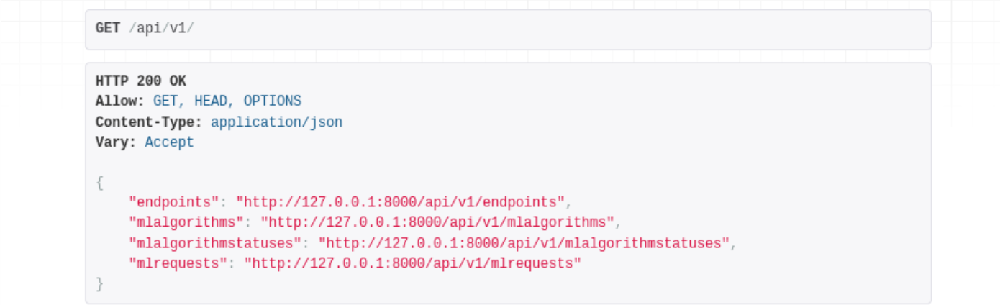

# Deploying Machine Learning Models with Django
Tools used: Machine Learning with Python (Sklearn, pandas, numpy), Django(REST, POST), SQLite  

The purpose of this project was to build a Machine Learning model that predicts income level based on census data, and then to deploy that model to a Django server. In this project I utlized the Random Forest and Extra Trees algorithms for machine learning predictions, and built a django server that had interactivity using REST API. SQLite was the database of choice. Finally, I ran an A/B test to see which algorithm (random forest vs extra trees) yielded better results.  

The code for the machine learning training can be found [here](https://nbviewer.jupyter.org/github/pratsingh/ML_Django_Project/blob/main/research/ML.ipynb).

 

